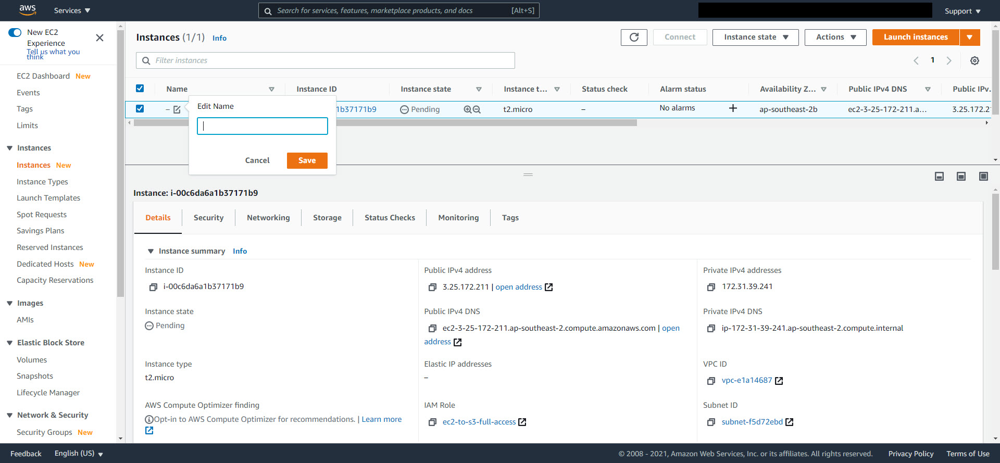
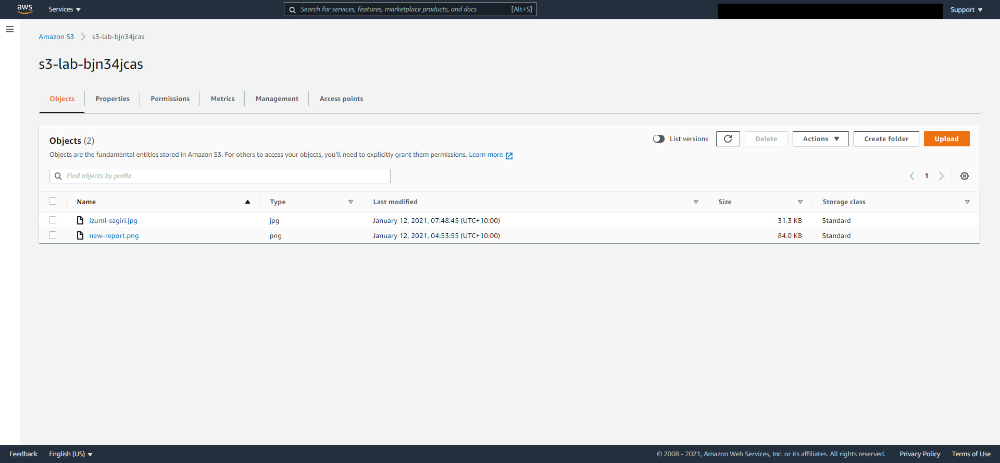

# AWS-S3-Lab-EC2-Versioning
---
## Thực Hiện: Minh Hùng Lê
---
## Tham Khảo: [QWIKLABS](https://www.qwiklabs.com/focuses/15683?catalog_rank=%7B%22rank%22%3A2%2C%22num_filters%22%3A0%2C%22has_search%22%3Atrue%7D&parent=catalog&search_id=8468941)
---
### Mục Tiêu Lab:
* Tạo IAM Role
* Tạo AWS S3 Bucket
* Hiểu được cách public file trên AWS S3 / S3 Bucket
* Tạo 1 AWS EC2
* Thực hiện việc upload và download (copy) file(s) từ AWS S3 qua EC2
* Upload files từ máy của mình (on-premise) lên EC2 và S3
* S3 Versioning 
---
### Yêu Cầu bài Lab
* Đã được làm quen với giao diện AWS Console
* Hiểu khái quát về các dịch vụ AWS, IAM, S3 và EC2 là 1 lợi thế
* Có sẵn / tạo 1 IAM user với **full quyền administrator**, có **secret key** và **secret access key**
* Đã biết sử dụng qua Putty để connect EC2 Instance
* Đã biết cách sử dụng Putty và convert keypair qua định dạng Putty Key (.ppk)
* Biết sơ về linux command
* Đã cài sẵn Putty và WinSCP
* Tạo sẵn 2 hoặc 3 file text hoặc file ảnh nhẹ (~50kb) để test. Github user có thể vào folder file để down.
--- 
### Lời Nhắn: 
Bài lab này, bạn hoàng toàng có thể tự tạo account để làm theo link tham khảo mình đã đưa ở trên. Hoàng toàn FREE. Tuy nhiên, mình dựa vào bài lab đó và viết lại vì những lý do sau đây:
* Bài lab trên đã sẵn có EC2 và các files/folders
* Bạn chỉ việc thực hiện hoàng toàn step-by-step
* Nhưng sau khi hoàng thành, bạn sẽ Không Hiểu được vì sao đánh command theo nó lại thực hiện được, vì sao EC2 lại truy vấn files từ S3, và nhiều cái khác.
* Bạn nên hiểu, khi đi làm thì sẽ không có sẵn EC2 hay IAM Role hoặc files để cho bạn làm 1 cách nhàn nhã như vậy. 
* Sau cùng, lab chỉ hướng dẫn làm, và sẽ không đưa ra bất cứ 1 link tham khảo nào ngoại trừ 2 link đã đưa. Nếu bạn muốn hiểu rõ hơn vì sao nó lại như vậy, hãy Google/Bing. 
* Bài lab sẽ rất ít viết ra command. Nên các bạn chú ý hình ảnh để đánh theo command. Tránh tình trạng copy/paste
* Tên bucket thường khó viết lại. Nên 1 mẹo nhỏ là trong command-line, lúc nào bạn cũng phải list file/folder. Nó sẽ hiện ra tên folder/file. Dùng chuột trái tô đậm tên folder/file mong muốn => click chuột phải nó sẽ tự động copy xuống dòng command kế típ. 
---

## Lab S3 và EC2
1. Đăng nhập vào AWS Console
2. Tìm dịch vụ IAM Role và tạo Role như sau

3. Trở ra lại AWS Console và tìm EC2
4. Truy cập vào EC2 Console và tạo 1 EC2 => **Launch Instance**

5. Filter: Free Tier => Amazon Linux 2 AMI - 64 bits

6. Gán IAM Role cho EC2: Phần **IAM ROLE => chọn Role đã tạo lúc đầu**

7. Sau đó next đến khi nhìn lên thấy đang ở **6 Configure Security Group**. Tạo Security Group như hình, sau đó **Review and Launch => Launch**

    * **Lưu Ý:** file keypair phải được download về máy và save ở chỗ nào mà dễ truy cập (thí dụ: desktop). Sau đó thì mới có thể **Launch Instance**
    * Sau khi launch instance, chạy **PuTTYgen** => load key => tìm key mà vừa được download khi tạo EC2 => Nếu không thấy thì chọn All File sẽ thấy key => Save Private Key => Save lại key này vào chỗ thích hợp trên máy

8. Sau khi tạo xong thì edit instance name cho khỏi nhầm với những instance khác (nếu có): tick chọn instance đang **Running** => bấm chỗ name để edit. 

9. Tìm phần mềm **WinSCP** và tải về 
10. Configure WinSCP kết nối EC2
    * Chọn EC2 đang Running => Sẽ thấy xuất hiện phần details của EC2 mà mình chọn ở dưới
    * Copy Public IPv4 DNS => bấm icon ô vuông copy kế bên aws sẽ tự động copy
    * Setup như hình, phần Hostname trên WinSCP thì paste Public IPv4 DNS vào => Sau đó chọn **Advanced** 
    * Advanced => Authentication => link PuTTY Key vừa tạo ở trên => OK
    * Sau đó bấm **Login**

11. Login thành công thì bên trái sẽ là On-Premise, và bên phải sẽ là EC2. Ngoài ra, nhìn lên đầu của cửa sổ WinSCP thì sẽ thấy info của EC2 mà mình cung cấp.
12. Bên phía EC2, phần làm việc sẽ là **home/ec2-user/**
13. WinSCP => phần EC2 => tạo 1 thư mục tên tuỳ ý. Lab sẽ tạo là: home/ec2-user/**new-report-s3-lab** ==> tên folder **new-report-s3-lab** này sẽ thay đổi do phải test nhiều thứ theo đó mà đã xoá và tạo lại. **NHƯNG** tính chất bài lab không thay đổi. 
14. Thử upload file lên EC2 và failed. Cách khắc phục
    * Lý do upload files failed là do folder không có full quyền. Cần full quyền để thực hiện remote upload
    * Trong hình sẽ là 3 lần set permission cho folder mới tạo vì lý do test xem quyền hạn nào thì có thể thực hiện được. Khi thực hiện **lab**, chỉ cần set 777 là được
    * Sau đó thì upload sẽ thành công

15. Kết nối PuTTY client sử dụng SSH để làm việc trên EC2 command-line interface.
16. chuyển qua quyền admin trong ec2 command-line, đổi về root và update os. Sau khi update xong thì clear screen cho dễ thao tác
    * **sudo su => enter**
    * **cd ~ => enter**
    * **pwd => enter** (check root)
    * **clear => enter**

17. run command **aws configure**

18. Đi đến folder ec2-user và tạo 1 folder. Refresh bên phía WinSCP sau khi tạo xong để check đã tạo thành công. Trở lại **bước 14** nếu folder mới tạo bị lỗi **permission denied** khi upload/tạo file
 
19. Nếu bạn còn giữ folder ở **bước 14** thì típ tục. Hoặc tạo lại và upload lại file bằng WinSCP
20. Check file bên phía EC2
 
21. Trở lại AWS Console, tìm S3 và vào S3 Console. Tạo 1 S3 bucket: **Create Bucket**

22. Bucket name và region: 
    * Bucket name: ngắn và phân biệt (unique). Thí dụ: s3-lab-kjh897
    * region: chọn region gần nhất nơi mình ở

23. Upload file lên bucket vừa tạo. Bucket mới tạo không có file(object) => Upload

24. Bucket sau khi đã upload file thành công

25. Click chọn file => Properties => Object URL. Bấm mở link sẽ thấy không thể truy cập được file => lý do là S3 Bucket  mặc định block tất cả Puclic Access. Giữ Nguyên Trang Web Object

26. Chọn Bucket mới tạo => Permissions => Block Public Access => Edit => **Unckeck** Block  All Public Access => SAVE CHANGES => CONFIRM

27. Chọn file vừa upload => Object Action => Make Public => Refresh lại trang mở object => File đã có thể được xem

28. Upload thêm 2 hoặc 3 file mới lên bucket

29. Chọn một trong 2 file mới vừa upload và thử truy cập như vừa làm => sẽ bị Access Denied.

30. Mở Public Access cho 1 object: Chọn Object => Permissions => Access Control List (ACL) => Click EDIT => làm/tick chọn theo hình => SAVE CHANGE

31. Thành công truy cập object vừa mới upload

32. Thực hiện copy file/object từ S3 Bucket qua EC2. Sau đó check file trên EC2 command-line và WinSCP (chuột phải WinSCP => Refresh)

---
## S3 Versioning 
1. File text đã được sử dụng ở trên => Copy qua 1 chỗ khác để tránh Windows hỏi về file duplication => mở ra => edit thêm bớt vài chữ => Save và đóng lại. Lưu ý **KHÔNG ĐỔI TÊN FILE**
2. Enable Bucket Versioning: Chọn Bucket => Properties => Bucket Versioning => Edit => SAVE CHANGES

3. Upload file vừa thay đổi nội dung lên S3 Bucket

4. Trở về bucket => bấm **List Versions** => Nếu không thấy gì thì bấm ký hiệu **Refresh** kế bên
    * Sẽ thấy version của file vừa uploaded
    * Chú ý cột Version ID, chỉ có 1 file vừa upload là có version. Những file còn lại là **NULL**. Lý do là những file đó uploaded **trước** khi enable S3 Bucket Versioning

5. Truy cập cả 2 file cùng tên vừa update. để so sánh version và content. Nếu bị Access Denied => Mở Public Access cho object như đã làm.

6. Thử xoá 1 object có version: chọn Object => Delete 

7. List Versions kiểm tra lại thì thấy object không bị delete mà thêm vào 1 object **type: Delete Marker**. 
    * Khi delete 1 object trong bucket đã Enabled Version, thì object đó **KHÔNG** bị AWS xoá đi mà nó sẽ mark (đánh dấu) object đó => Delete Marker
    * Do vậy, khi Enabled Version cho bucket thì object sẽ được sao lưu an toàn tránh tình trạng **"lỡ tay mạng lag"** mà delete
    * Bucket Versioning không thể kích hoạt (active) cho từng object mà chỉ có thể active cho từng bucket
    * Khi 1 bucket đã được Enabled Versioning Control, thì những object lưu trong bucket đó sẽ có được version
    * Nên khi trong thực tiễn công việc, hãy thiết lập version cho bucket ngay từ lúc khởi tạo. 

8. Khôi phục object đã xoá khi đã Enabled Bucket Versioning bằng cách Delete object có **type : Delete marker**

9. Thử Delete 1 object đã được enabled versioning control: Chọn object có version mới nhất => Delete 

10. Ra lại bucket và thấy không có object. Nhưng khi **List versions**
thì sẽ thấy còn lại 1 object => check content của object đó thì đã thấy content như lúc ban đầu

---
## Bài lab đã xong. Hãy nhớ xoá đi tất cả những gì đã làm để tránh việc chi trả phí AWS không cần thiết.

